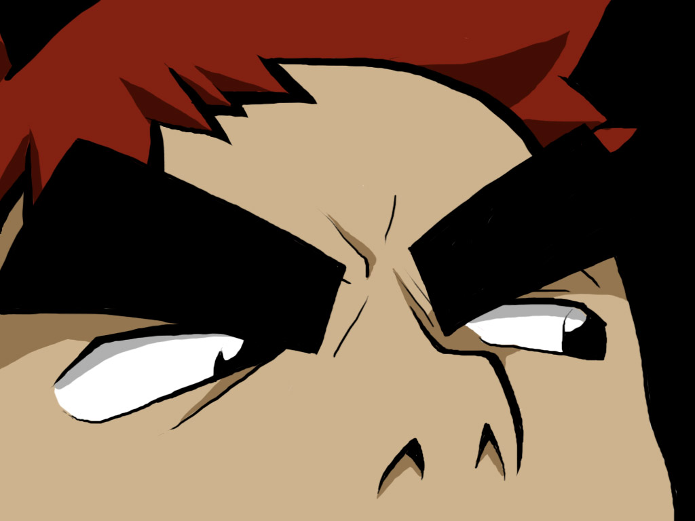
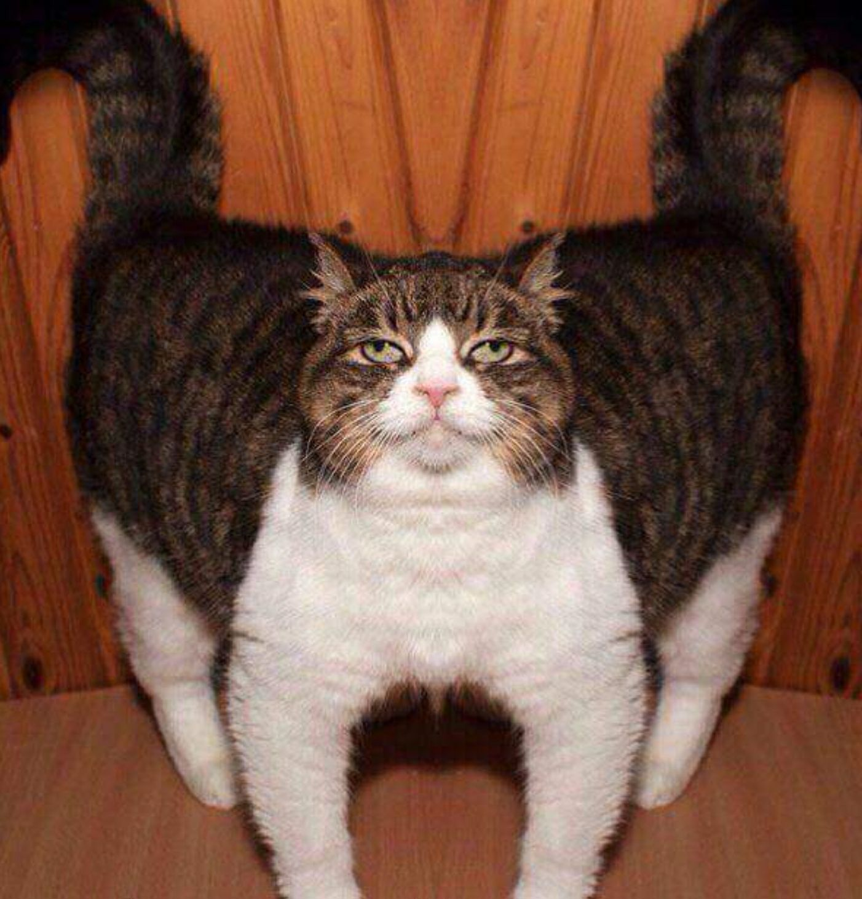
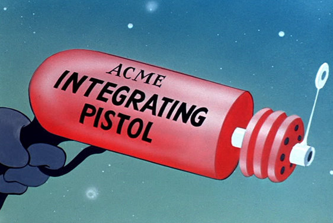

# gbprinter
Convert images to GameBoy screenshots.

Installation
---

```bash
go get github.com/ProfOak/gbprinter
```

Usage
---

```bash
gbprinter image.png
```

The resulting image will be named `image_color-palette.png`


Extra
---

```bash
gbprinter -help
Usage of gbprinter:
  -palette string
          Color choices: down, downa, downb, grayscale, greenscale, left, lefta, leftb, right, righta, rightb, up, upa, upb (default "grayscale")
```

Examples
---

### Grayscales










### Greenscale and the other color palettes


